The **Launch Point** configuration is used to describe how the wishlist is launched from your shop. There are three basic styles that can be used:

- Adding the wishlist to the page header (this is the default);
- Exposing the wishlist via a menu item; or
- Having a floating button used to access the wishlist.

Using the selection at the top of the Launch Point configuration, you can choose which of the three options you want to use.

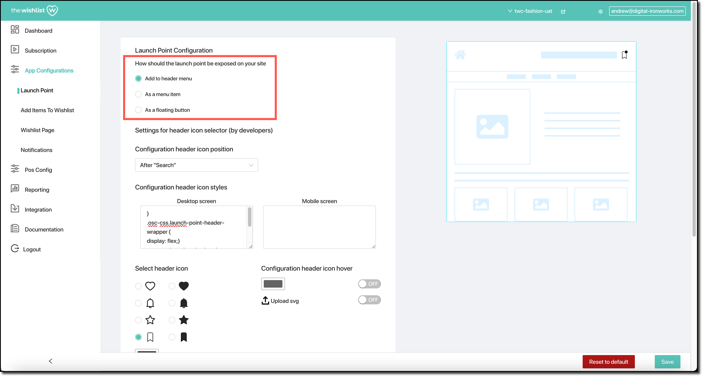

Based on your selection, the rest of the Launch Point configuration will change.

## Launching via the page header

If you elect to use the page header to launch The Wishlist, there are a number of additional configuration options available for you to fine-tune the way the header is used.

As you work through these options, a wireframe page template shows the effect of your changes.

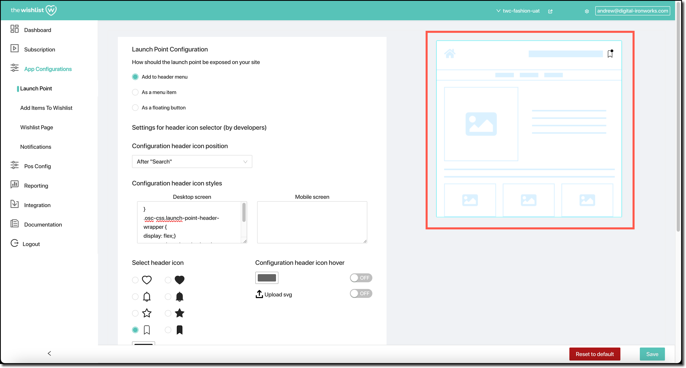

### Header icon position

There are four options available that you can use to configure where the icon for The Wishlist appears on your page header. They are all available from the “Configuration header icon position” drop-down list.

These options are:
- `Before Search` — the icon will be added into the header immediately before your search field
- `After Search` — the icon will be added into the header immediately after your search field
- `Before Cart` — the icon will be added into the header immediately before your cart icon
- `After Cart` — the icon will be added into the header immediately after your cart icon

#### Header icon styling

Having chosen the position of your header icon, you can fine-tune that position by supplying a CSS fragment that is used to style the header icon.

You can configure two CSS fragments — one for desktop class devices, and one for mobile class devices.

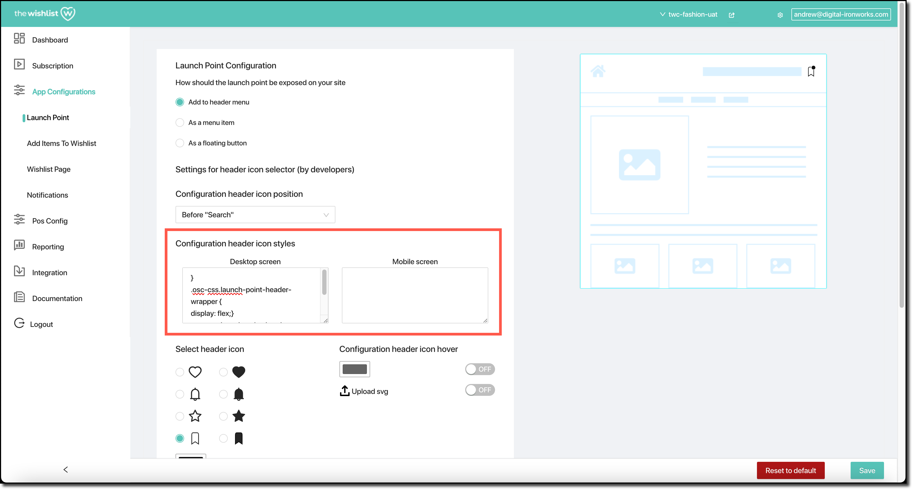

### Header icon

The actual icon used to display The Wishlist in your page header can be customised.

Four standard icons are available: a heart, a bell, a star, or a ribbon. You can also upload your own `.svg` file if there's a specific icon that you want to use. For the four standard icons, you have an option of using either an outline or a filled-in icon. You can also choose the icon colour.

As well as the icon used to display The Wishlist, you can optionally define an additional “hover” icon colour, or a custom icon that's displayed when a desktop customer hovers their mouse pointer over the wishlist icon.

You can further configure the icon by specifying its size in both width and height. This can be done for the basic icon and the hover icon.

These options are all available in the header icon selection:

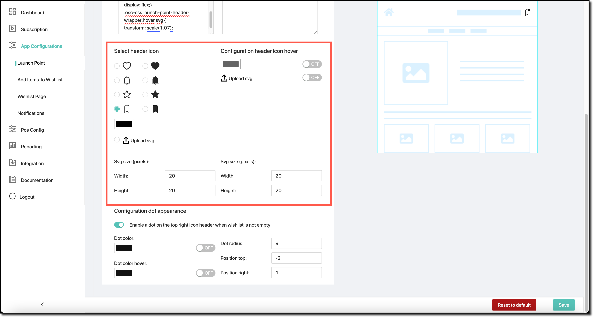

### “Dot” appearance

Finally, you can also configure the appearance of a dot used to indicate to the customer that their wishlist has one or more products in it. If the customer's wishlist is empty, the dot does not appear.

You can turn the indicator dot functionality on or off.

If the dot is turned on, you can select its passive colour and the colour that the dot changes to when a desktop user hovers their mouse over it. You can also configure the dot's size, and its position relative to the icon.

These are all accessible from the “Configure dot appearance” section of the page:

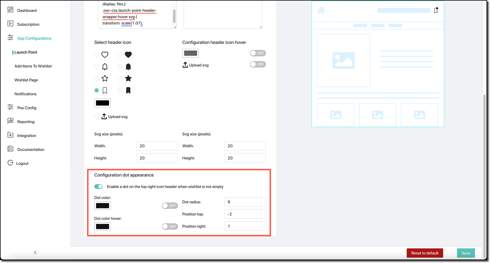

## Launching via a menu item

If you elect to have a customer's wishlist launched via menu item, there are five steps that you need to follow.

1. Go to your Shopify store administration page.
2. Select `Online Store` → `Navigation` → `Main Menu`, and then choose the `Add menu items` option.
3. Enter the menu item name as `Wishlist`, and select the link as `Pages/Wishlist`.
4. Click the `Add` button.
5. Click the `Save` button.

The wishlist will then be accessible as a menu item within your shop.

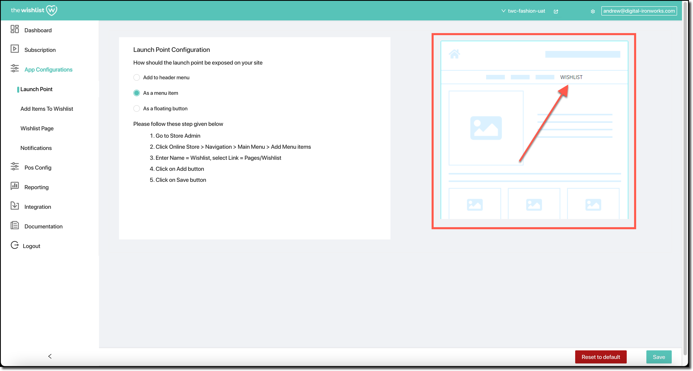

## Launching with a floating button

The final option available for display of the wishlist launch point is to use a floating button. This will be an icon that floats on top of the background page, and will stay visible even if the customer scrolls up and down a page.

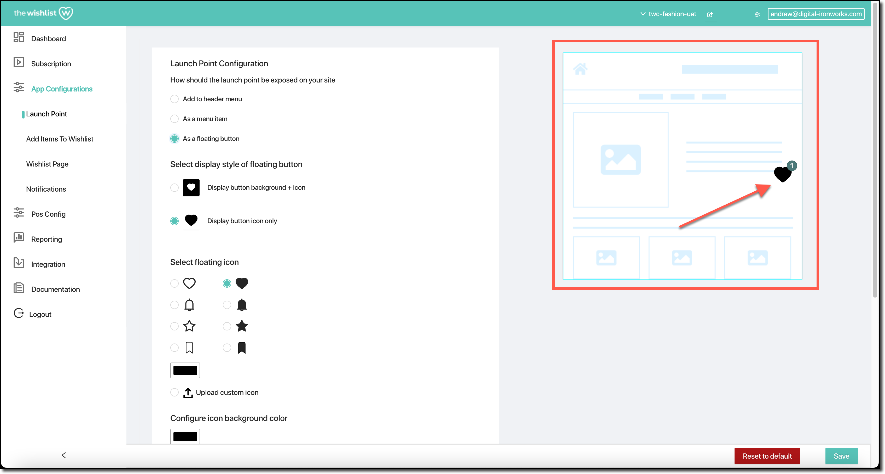

### Floating icon style

You can select the style of floating icon that you want. It can be either:
- A solid background square, with the icon shown inside that square; or
- The icon with a transparent background.

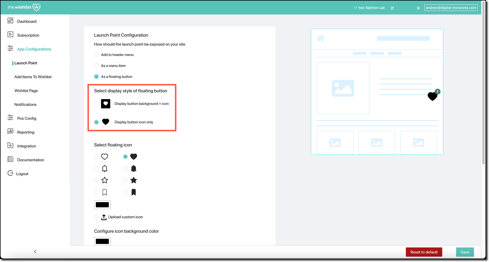

One word of caution: if you use the option with a background colour, you need to ensure that your icon and the background are different colours. By default both are black (`#000000`) and this simply results in a black square being shown. You'll need to ensure that you change either the background colour or the icon colour (or both) so that they are contrasting colours.

### Floating icon selection

Similarly to the way an icon can be selected for the header icon option, you can choose the icon to display in the floating icon. The same four defaults are available — heart, bell, star, and ribbon. You also have the option to upload your own `.svg` icon file.

The defaults are available as either an outline or a filled icon.

You can change the colour used for the icon, as well as the icon background colour. The background colour is only used if you've selected to use the background + icon style — if the icon-only style is used, the background colour doesn't matter.

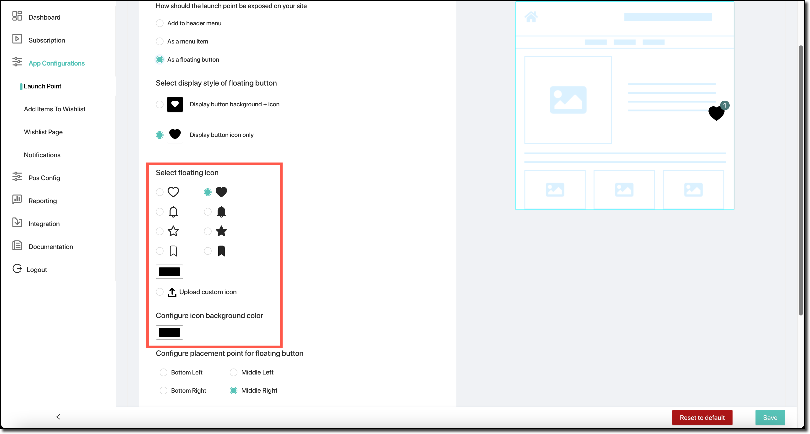

### Floating icon placement

You can select the placement for the floating icon. There are four options available:
- Bottom left
- Bottom right
- Middle left
- Middle right

As you make these changes, the wireframe template is updated to reflect your change.

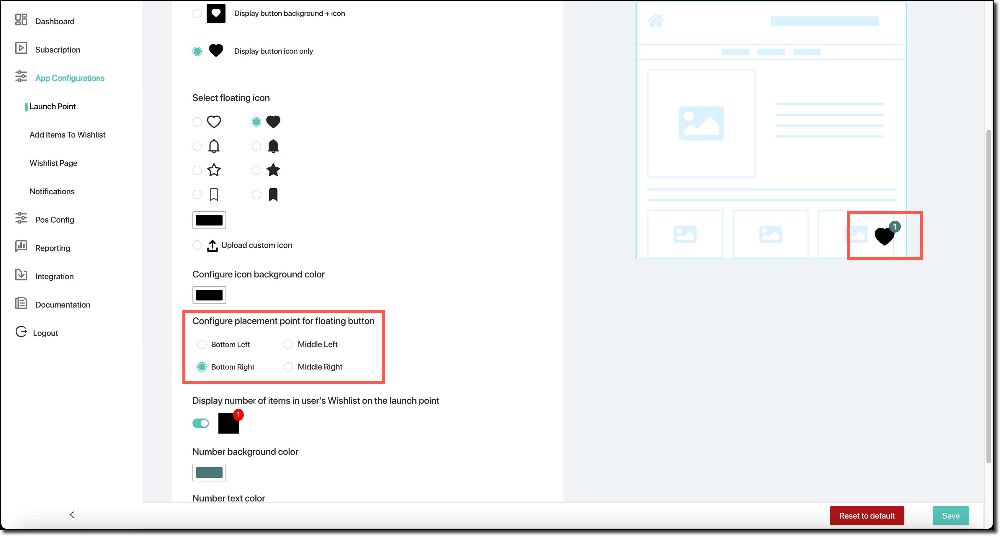

### Floating icon wishlist product count

The final option available with the floating icon is the way the product count is shown. This is the number products the customer currently has in their wishlist.

You can turn this on or off.

If it's turned on, you can configure:
- The text colour of the number;
- The background colour; and
- The font used to draw the number.

There are four font options: `inherit`, which uses the same basic font as the page hosting the icon, as well as `Georgia`, `Verdana`, and `Garamond`. `Georgia` and `Garamond` are both serif fonts, while `Verdana` is a sans-serif font.

All of these product count options are accessible in the `Display number of items in user's Wishlist on the launch point` area of the page:

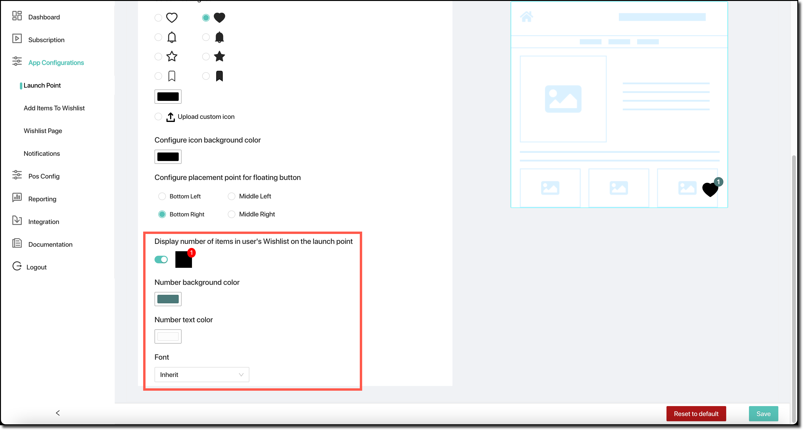

