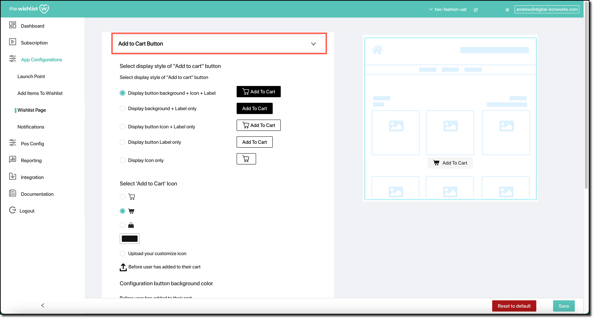
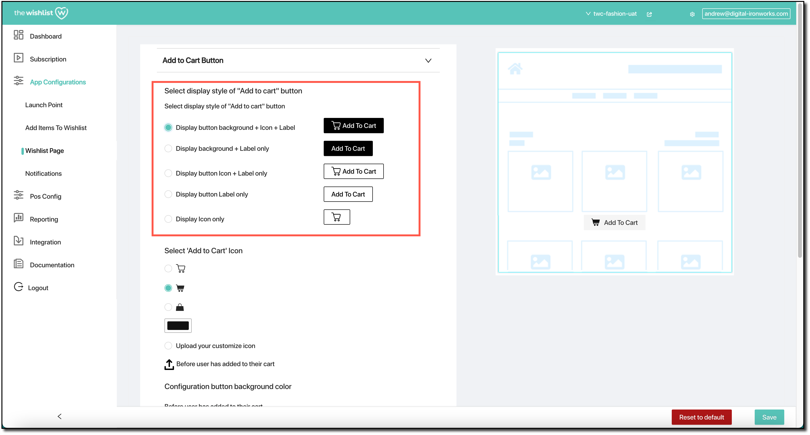
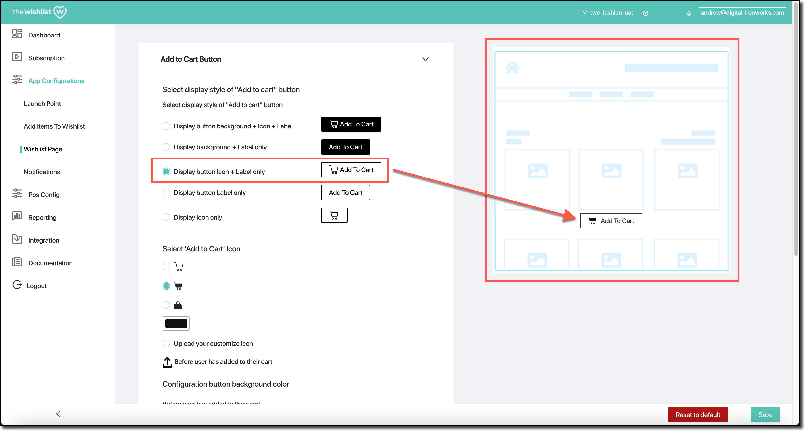
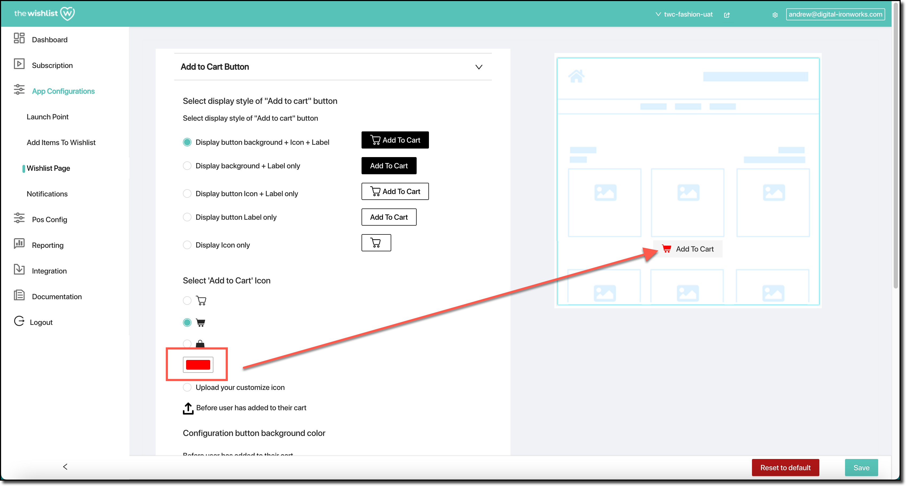
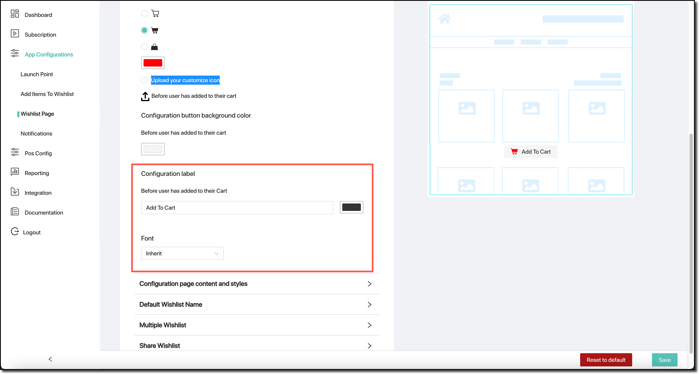
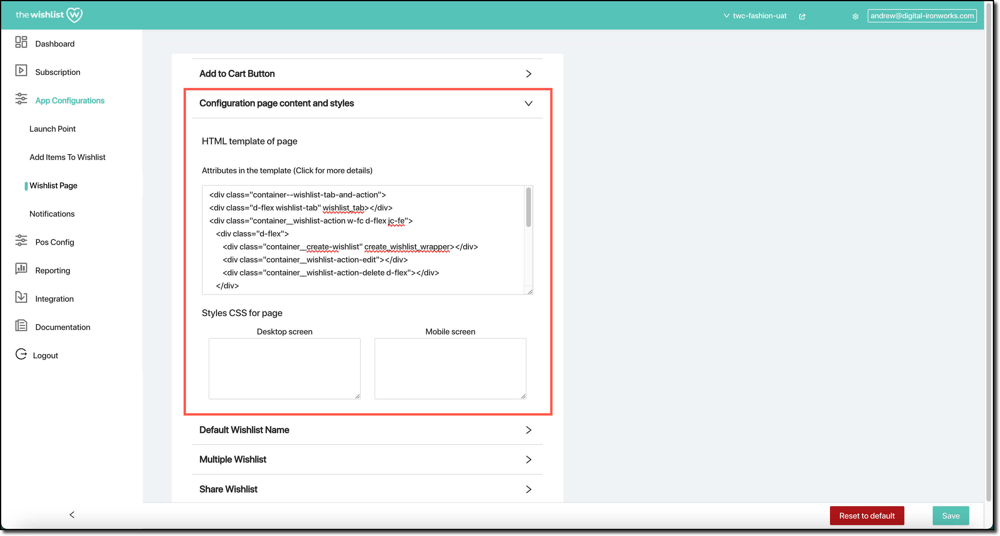
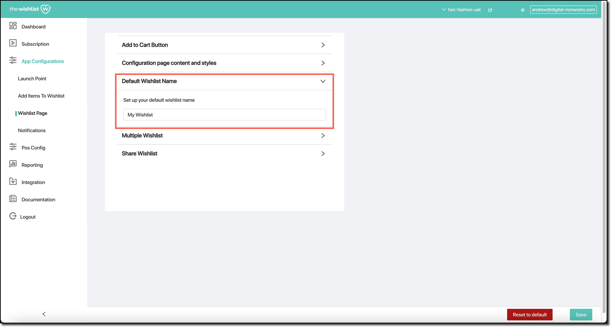
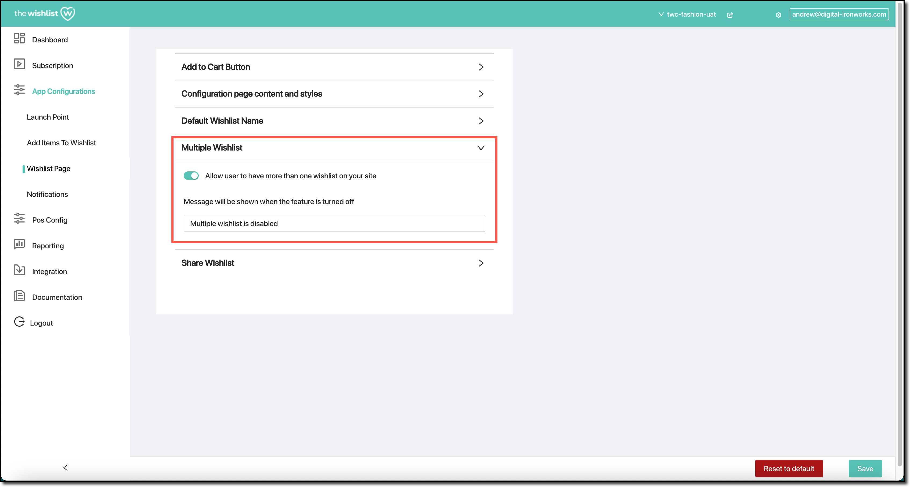
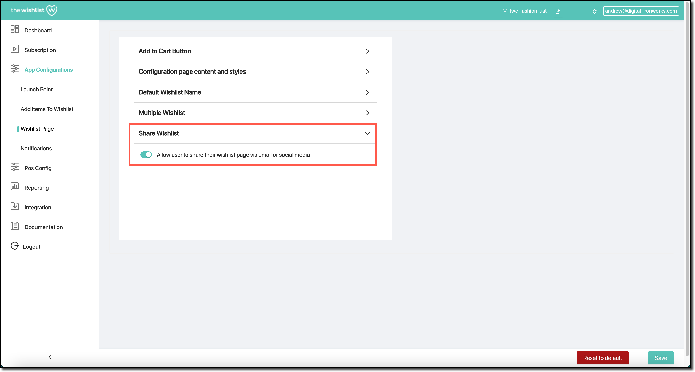

 
The **wishlist page** configuration can be used to customise the appearance of the customer's wishlist page. There are five different aspects of this wishlist page that you can configure.

- The [Add to Cart button](#add-to-cart-button) can be configured.
- The [page content and styles](#configure-page-content-and-styles) configuration can be used to describe what information is shown to the customer on their wishlist page.
- The [default wishlist name](#default-wishlist-name) is used to set the customer's default wishlist name.
- The [multiple wishlist](#multiple-wishlist) configuration is used to enable or disable multiple wishlists. If enabled, a customer can maintain multiple wishlists.
- The [share wishlist](#share-wishlist) configuration is used to describe whether a customer can share their wishlist via email or social media.

## Add to Cart Button

The **Add to Cart Button** configuration allows you to customise the appearance of the “Add to Cart” button shown on the customer's wishlist page. This allows you to customise this button so that it has the same visual characteristics (look & feel, colours, etc) as the other UI elements related to the customer's wishlist (such as the “Add to Wishlist” button).



There are several elements of the “Add to Cart” button that can be configured.

### Button style

First, you can configure the button shown to the customer against each product in their wishlist.



There are five basic options:

- Display button background + Icon + Label
- Display background + Label only
- Display button Icon + Label only
- Display button Label only
- Display Icon only

The visual effect of each of these options can be seen in the screenshot above.

If you change the button style, the wireframe in the top-right corner of the page will be updated to reflect your choice. For example:



### Button icon

If you are using one of the styles that includes an icon, you can define the icon that should be shown. There are three built-in icons: an outlined cart, a solid cart, and a bag.

You can also change the colour of the icon using the colour selector below the icon list. The following example illustrates:



If none of the builtin icons are appropriate, you can upload a custom icon using the “Upload your custom icon” option.

### Before user has added to their cart

```ad-warning
Need info from Matt and Shane on this one. It's unclear how this works.
```

### Message and font

The final option available is to define the message shown on the button, along with the colour and font for the message.



The default message is “Add To Cart”, shown in black. You can change both of these. The colour selection is shown after the message.

- Note that you will need to ensure that the message colour has a good contrast against the background colour. Showing a black text message on a black background, for example, just results in a block of black on the customer's page. The default is a light gray background and black text which provides a good starting point. You can, of course, customise the background and message colour to suite your brand's styling.

You can also select the font that the message is shown in. There are four font options: `inherit`, which uses the same basic font as the page hosting the icon, as well as `Georgia`, `Verdana`, and `Garamond`. `Georgia` and `Garamond` are both serif fonts, while `Verdana` is a sans-serif font.

## Configure page content and styles

The next section you can configure for the wishlist page is the content and style of the page shown to the customer.

There is a single definition of the content, and different styling options that can be applied to customers using either a desktop or mobile environment.

The following screenshot illustrates:



### Content

The content is provided as a HTML fragment that's injected into your wishlist page. You can customise it to influence the way the wishlist content is shown to the customer.

The default values are shown below:

```html
<div class="container--wishlist-tab-and-action">
  <div class="d-flex wishlist-tab" wishlist_tab></div>
  <div class="container__wishlist-action w-fc d-flex jc-fe">
    <div class="d-flex">
      <div class="container__create-wishlist" create_wishlist_wrapper></div>
      <div class="container__wishlist-action-edit"></div>
      <div class="container__wishlist-action-delete d-flex"></div>
    </div>
  </div>
</div>
<div class="p-15 pr-0 container--share-and-search">
  <div class="container__share-wishlist"></div>
  <div class="d-flex justify-center search-container"></div>
</div>
<div class="p-15 pr-0 product-list"></div>
<div class="p-15 container__pagination">
  <div class="pagination__page-size"></div>
  <div class="pagination__page-list"></div>
</div>
```

This is a good starting point for the wishlist content page. It includes:
- A list of the products that the customer has in their wishlist, along with buttons to edit and delete those products.
- A way to search for products in the wishlist.
- Pagination options.

```ad-warning
Want a store screenshot here, but it's offline.
```

If you want to customise this page, it's important to keep the core elements intact so that the wishlist page shows relevant details to the customer. You should limit your customisation to page layout and construction rather than wholesale changes to the information displayed.

### Styling

The two styling options can help in adjusting the page content to suit different size devices. You can provide a CSS fragment that applies to each size — one for desktop size devices, and another for mobile devices.

The appropriate CSS fragment will be used depending on the customer's device, allowing you to fine-tune the layout for devices of that class.

## Default Wishlist Name

The customer is able to rename their wishlist if they want — however, you can define what their default wishlist name is. The next configuration section shows this.



Making a change here will _not_ affect existing wishlists — it will only affect new customers who create their wishlist for the first time.

```ad-info
Validate this assumption!
```

## Multiple Wishlist

You can control whether or not customers can have multiple wishlists. If this option is turned off, customers can only have a single wishlist. If it's turned on, the customer can have multiple wishlists.



Note that if this option is turned on, and you then turn it off, any customer who had multiple wishlists will lose access to their additional wishlists. Only their default wishlist will be available to them. Those additional wishlists aren't destroyed, however — if you turn the option back on, those additional wishlists will once again become available.

## Share Wishlist

The final option available for configuring the customer's wishlist is to determine whether or not the customer can share their wishlist.



If this is enabled, the customer can share their wishlist via either an email message or using social media.

```ad-warning
What does this look like?
```
